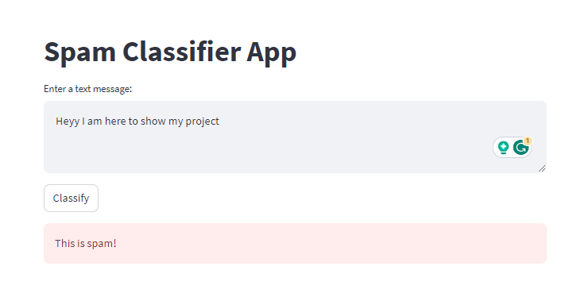

# Spam-Comments-Detection
Spam Comments Detection using Bernoulli Naive Bayes Algorthm




Certainly! Here's a README file that you can include with your project to provide instructions and information about the code:


---

# Spam Comment Detection using Naive Bayes and Streamlit

This project demonstrates a simple implementation of a spam comment detection system using the Bernoulli Naive Bayes algorithm and a Streamlit web app for user interaction. The goal is to classify text comments as either "Spam" or "Not Spam" based on their content.

## Prerequisites
Certainly! Here's a README file that you can include with your project to provide instructions and information about the code:

---

# Spam Comment Detection using Naive Bayes and Streamlit

This project demonstrates a simple implementation of a spam comment detection system using the Bernoulli Naive Bayes algorithm and a Streamlit web app for user interaction. The goal is to classify text comments as either "Spam" or "Not Spam" based on their content.

## Prerequisites

Before running the project, ensure you have the following installed:

- Python 3.x
- pandas
- numpy
- scikit-learn
- streamlit

You can install the required packages using the following command:

```bash
pip install pandas numpy scikit-learn streamlit
```

## Project Structure

The project consists of the following components:

1. `Youtube01-Psy.csv`: A CSV file containing example comment data for training and testing the model.

2. `spam_classifier.py`: The main Python script that loads the data, trains the model, saves the model and CountVectorizer, and creates a Streamlit app for user interaction.

3. `model.pkl`: The saved trained Naive Bayes model.

4. `countvectorizer.pkl`: The saved CountVectorizer used for text preprocessing.

## How to Run

1. Clone this repository to your local machine.

2. Place the `Youtube01-Psy.csv` file in the same directory as the script.

3. Open a terminal or command prompt and navigate to the project directory.

4. Run the following command to start the Streamlit app:

   ```bash
   streamlit run spam_classifier.py
   ```

5. A web browser window will open with the Streamlit app. Enter a text message and click the "Classify" button to see if the message is classified as spam or not.

## Notes

- The `spam_classifier.py` script loads the CSV data, preprocesses it, trains the model, and saves the model and CountVectorizer using the `pickle` module. This way, the trained model can be loaded and used for classification without needing to retrain it every time.

- The Streamlit app allows users to input a text message and click a button to classify it as spam or not. It loads the saved model and CountVectorizer to preprocess and classify the text.

- Make sure to customize and improve the model, data preprocessing, and the user interface as needed for your specific use case.

## Acknowledgments

- The comment data used in this project is from the YouTube dataset "Youtube01-Psy.csv," available on the [UCI Machine Learning Repository](https://archive.ics.uci.edu/ml/datasets/YouTube+Spam+Collection).

- Streamlit is used for creating the user interface of the app. You can learn more about Streamlit at [https://streamlit.io/](https://streamlit.io/).

---

Feel free to modify the README file to include any additional information or explanations as needed for your project.
Before running the project, ensure you have the following installed:

- Python 3.x
- pandas
- numpy
- scikit-learn
- streamlit

You can install the required packages using the following command:

```bash
pip install pandas numpy scikit-learn streamlit
```

## Project Structure

The project consists of the following components:

1. `Youtube01-Psy.csv`: A CSV file containing example comment data for training and testing the model.

2. `spam_classifier.py`: The main Python script that loads the data, trains the model, saves the model and CountVectorizer, and creates a Streamlit app for user interaction.

3. `model.pkl`: The saved trained Naive Bayes model.

4. `countvectorizer.pkl`: The saved CountVectorizer used for text preprocessing.

## How to Run

1. Clone this repository to your local machine.

2. Place the `Youtube01-Psy.csv` file in the same directory as the script.

3. Open a terminal or command prompt and navigate to the project directory.

4. Run the following command to start the Streamlit app:

   ```bash
   streamlit run app.py
   ```

5. A web browser window will open with the Streamlit app. Enter a text message and click the "Classify" button to see if the message is classified as spam or not.

## Notes

- The `spam_classifier.py` script loads the CSV data, preprocesses it, trains the model, and saves the model and CountVectorizer using the `pickle` module. This way, the trained model can be loaded and used for classification without needing to retrain it every time.

- The Streamlit app allows users to input a text message and click a button to classify it as spam or not. It loads the saved model and CountVectorizer to preprocess and classify the text.

- Make sure to customize and improve the model, data preprocessing, and the user interface as needed for your specific use case.